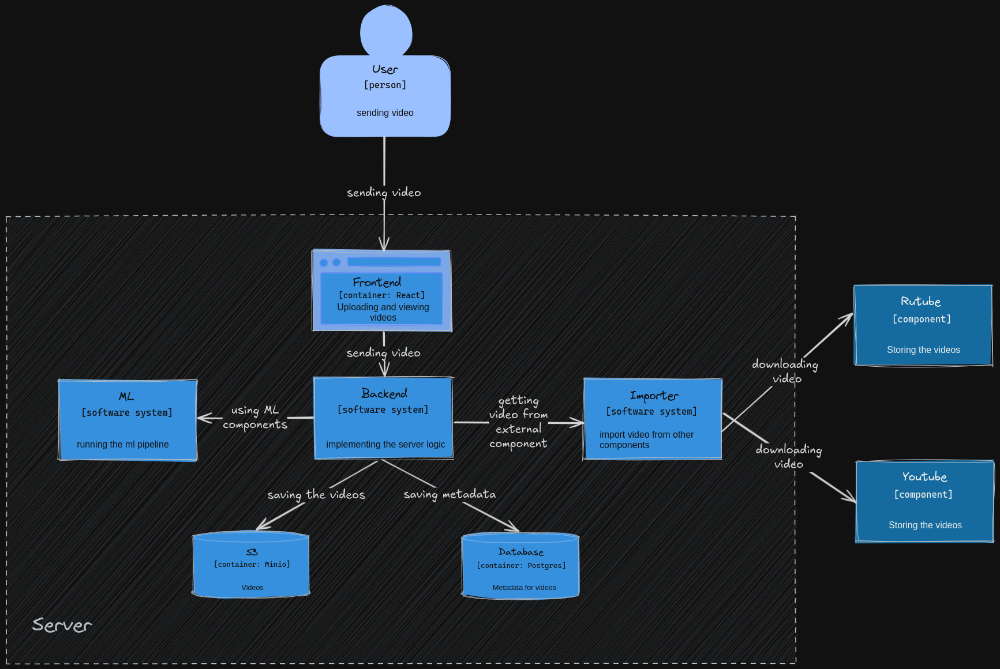

### Описание
https://drive.google.com/drive/folders/1tq3bh6h_l8EkbR4u1NEPUD02GNUHALH_?usp=drive_link
Проект представляет собой иерархическую мультимодальную классификацию, использующую данные видео, аудио и текста для предсказания тегов на разных уровнях иерархии. Основной компонент системы — модель Hierarchical Multimodal Classifier, обученная на мультибинарных закодированных метках для трех уровней категорий.

Процесс обработки данных включает:

Извлечение эмбеддингов из видео, аудио и текстовых описаний с помощью моделей, таких как ImageBind для мультимодальных данных и Whisper для преобразования аудио в текст.
Использование трансформаций видео для предобработки кадров и преобразование их в формат, подходящий для модели.
Предсказание тегов с применением иерархических масок для сохранения связи между родительскими и дочерними категориями.

Проект поддерживает предварительное вычисление эмбеддингов для ускорения инференса, а также кэширование этих данных для повторного использования. Теги предсказаний декодируются с учетом иерархии, что позволяет удалять избыточные метки более высокого уровня, если на низших уровнях присутствуют более конкретные категории.

Основные задачи включают:

Иерархическую обработку данных на основе мультимодальных входов (видео, аудио, текст).
Оптимизацию загрузки и обработки данных для эффективной работы на GPU/CPU.
Кэширование и предобработку данных для ускорения инференса.

## Пайплайн
### URL: https://185.50.202.76.sslip.io/
### 1. Ввод данных
- **Видео + Текст**: На вход подается видео с сопутствующим текстовым контентом.

### 2. Извлечение данных
Из входного видео и текста извлекаются различные компоненты:
- **Название**: Заголовок видео.
- **Описание**: Описание, предоставленное пользователем.
- **Поток кадров**: Последовательность видеокадров.
- **Субтитры**: Автоматически сгенерированные или предоставленные субтитры.
- **Аудио**: Звуковая дорожка из видео.

### 3. Обработка данных
Для извлечения данных используются различные модели:
- **Whisper**: Модель для автоматической транскрибации речи в текст.

### 4. Создание эмбеддингов
- **ImageBind**: Все извлеченные компоненты (название, описание, поток кадров, субтитры, аудио) преобразуются в эмбеддинги в едином векторном пространстве.

### 5. Классификация
- **Custom Hierarchical Transformer**: Полученные эмбеддинги используются в пользовательском иерархическом трансформере для классификации.

### 6. Предсказание категорий
- **Функция активации**: Применяется функция активации для получения вероятностей принадлежности к различным категориям.

### 7. Результат
- **Список категорий и их вероятности**: На выходе получается список категорий с вероятностями, указывающий на то, к каким категориям может относиться данное видео в иерархической структуре.

### 1. Клонирование репозитория

Для начала клонируйте репозиторий на вашу локальную машину:

```bash
git clone https://github.com/PocketBrain/TaggerHack
cd https://github.com/PocketBrain/TaggerHack
```

### 2. Создание и настройка файла окружения для Docker

Скопируйте пример файла окружения `.docker/.env.example` в `.docker/.env` и заполните необходимые переменные:

```bash
cp .docker/.env.example .docker/.env
nano .docker/.env
```

### 3. Создание и настройка файла конфигурации

Аналогично, скопируйте пример файла конфигурации `configs/.env.example` в `configs/.env` и укажите соответствующие переменные:

```bash
cp configs/.env.example configs/.env
nano configs/.env
```

### 4. Запуск Docker Compose

После настройки всех конфигурационных файлов запустите Docker Compose для сборки и запуска контейнеров:

```bash
docker compose up --build
```

Убедитесь, что все переменные окружения и конфигурационные файлы корректно настроены перед запуском команд.

### C4


### ml
1. [Summarizer](./ml/summarizer) - модель суммаризации для вытаскивания смысла из описания
2. [pipelines](./ml/pipilines) - паплайн инференса и трейна для HMC
3. [models](./ml/models) - все используемые модели
4. [HMC](./ml/HMC) - модель иерархической многоклассовой классификации
